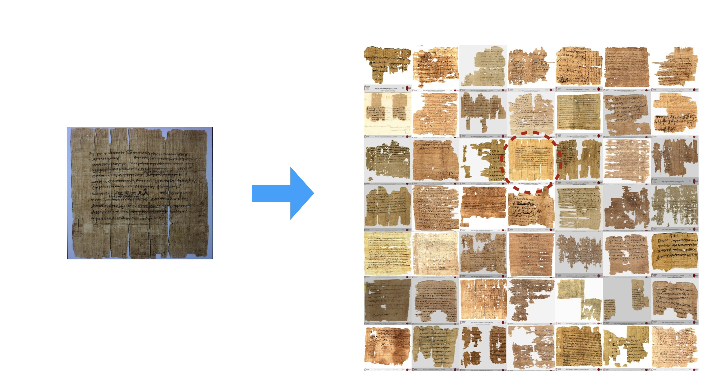
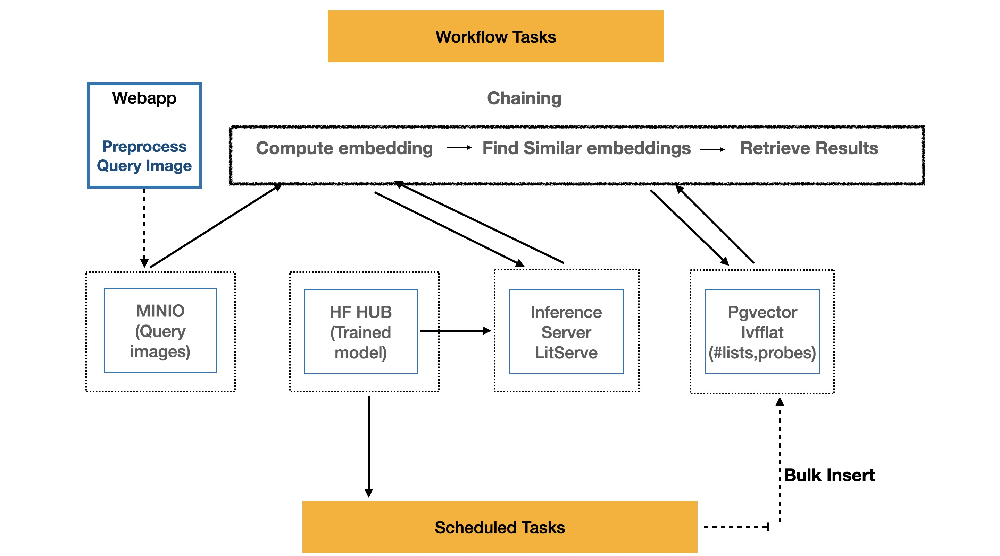
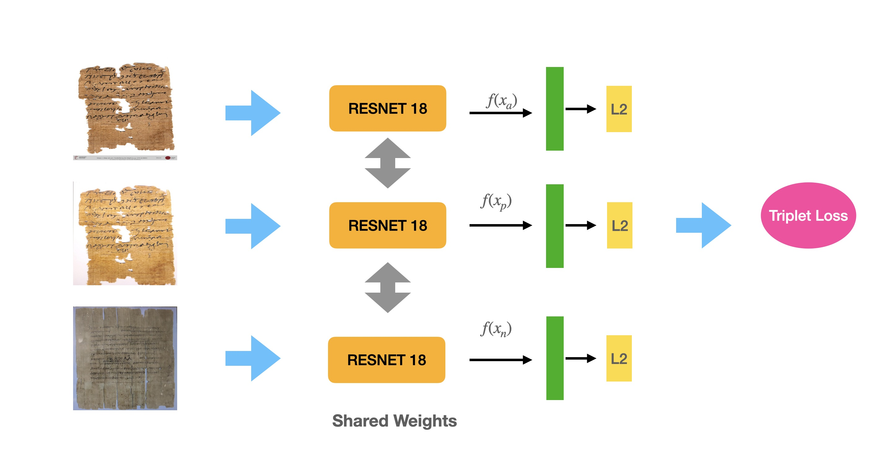
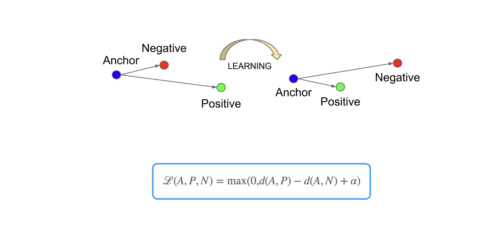

This code is written for a software practical course at Heidelberg University.

# Papyrus Retrieval

## Documentation

The full documentation for this project is hosted on [Read the Docs](https://image-retrieval.readthedocs.io/).


# Introduction

This project is an end-to-end image retrieval webapp! Our main goal is to retrieve similar papyrus images. This can be thought of as 'Google Lens' for papyrus images. The result is a hyperlink to the most similar papyrus, and the corresponding metadata and information about it can be found on [papyri.info](https://papyri.info/).





## Demo

Use the installation guide to set up the project and download the data for the demo. Once the installation is successful, the webapp can be launched.


## Installation

To install **Papyrus Retrieval**, follow these steps:

1. **Clone the repository**

    ```bash
    git clone https://github.com/veerav96/image-retrieval.git
    ```

2. **Install Pre-Requisites**

    Install **Mamba** and **Docker Engine** before proceeding:

    - **Mamba**: A faster alternative to Conda for managing environments. Follow the installation instructions at the official Mamba documentation:

      [Mamba Installation Guide](https://mamba.readthedocs.io/en/latest/installation/mamba-installation.html)

    - **Docker Engine**: Ensure Docker is installed and running on your machine. Follow the installation steps based on your operating system:

      [Docker Installation Guide](https://docs.docker.com/engine/install/)

3. **Create the development environment**

    ```bash
    mamba env create -f environment.yaml
    ```

4. **Local Infrastructure**

    The application uses **docker-compose**. It installs dependent services and sets up the development infrastructure.

    ```bash
    cd infra
    docker compose up -d
    ```

5. **Database Schema**

    To initialize and migrate the PostgreSQL schema, we use [Alembic](https://alembic.sqlalchemy.org/en/latest/).

    The following commands need to be run when working on an empty DB or if the DB schema gets updated:

    ```bash
    export PYTHONPATH="src:$PYTHONPATH"
    export $(xargs < .env)
    alembic upgrade head
    ```

    To create a new revision:

    ```bash
    export PYTHONPATH="src:$PYTHONPATH"
    export $(xargs < .env)
    alembic revision --autogenerate -m "Custom migration message"
    ```

6. **Data**

    To bulk insert reference papyrus images into the database, run the following command (adjust the folder path where images are located):

    ```bash
    python -m src.tasks.scheduled_tasks
    ```

7. **Run**

    Before running the application, create an `.env` file using the `.env_template`. Populate the `.env` file with relevant configuration.

    **Celery**: Run the background task workers:

    ```bash
    export $(xargs < .env)
    export PYTHONPATH="src:$PYTHONPATH"
    celery -A src.tasks.workflow_tasks worker -l INFO &
    ```

    **Webapp**: Run the FastAPI/uvicorn webserver:

    ```bash
    export $(xargs < .env)
    export PYTHONPATH="src:$PYTHONPATH"
    python src/main.py &
    ```

    Go to `https://localhost:8000` to see the webpage in action. Alternatively, go to `https://localhost:8000/docs` to see the API in action.

    **Inference Server**: Run the [litserve](https://lightning.ai/docs/litserve/features/gpu-inference) powered inference server:

    ```bash
    python -m src.inference.server &
    ```

    Go to `https://localhost:8001/docs` to see the inference API in action.


# How this works!

## Software Architecture

FastAPI is used to serve users. When a user submits a request, an image retrieval task is created on the backend and delegated to Celery workers. This approach ensures a responsive user interface and prevents overloading the web application. Celery, integrated with Redis, manages the task queue and tracks the status of each task. The client polls the server every second to fetch the current status and delivers the result once it is ready.


## Workflow

When a user uploads a query image, it is first preprocessed and stored in a MinIO bucket. A Celery worker then requests the inference server to compute an embedding for the image using a trained model hosted on my Hugging Face Hub. Next, the system searches for the most similar images by comparing the computed embedding with precomputed embeddings of reference papyri images, which have been bulk-inserted into a PostgreSQL database.




## Neural Network Architecture

The model employs a Siamese architecture built on a ResNet18 backbone to generate 128-bit embeddings. During training, the model processes image triplets consisting of an anchor image, a positive image (similar to the anchor), and a negative image (dissimilar to the anchor). A triplet loss function is used to optimize the model.




## Objective Function

The goal is to minimize the distance between the anchor and positive while maximizing the distance between the anchor and negative. This way, the model learns to create embeddings that cluster similar images closer together and separate dissimilar ones.




## Fine Tuning

The model leverages a pretrained ResNet18 trained on ImageNet. During fine-tuning, the last block of layers is unfrozen and trained further to adapt to learn papyrus images, while all preceding layers remain frozen to retain their learned features from the original dataset.


## Results


