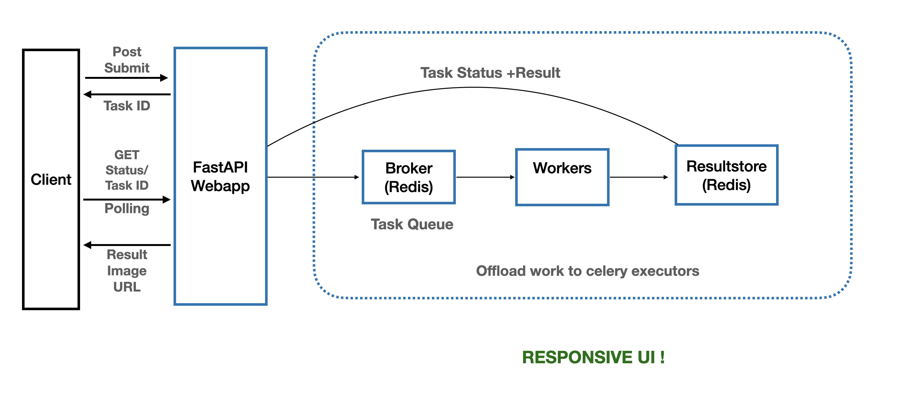
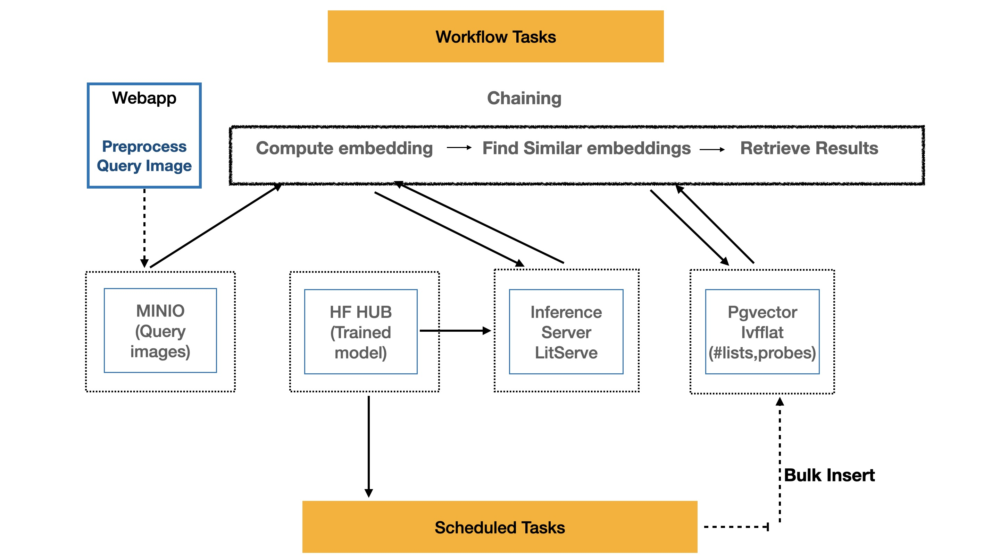
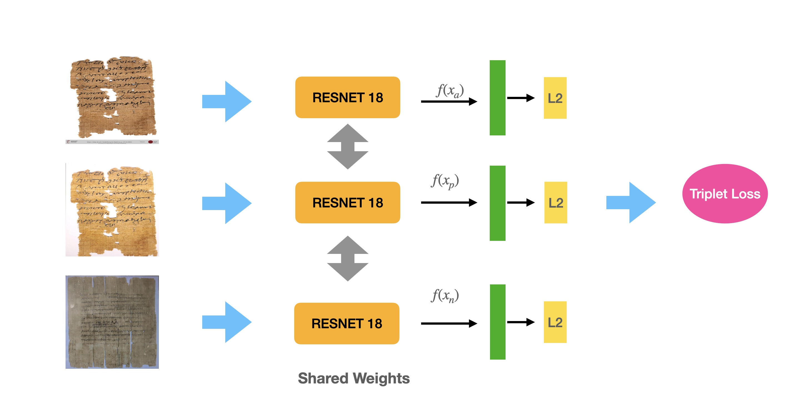
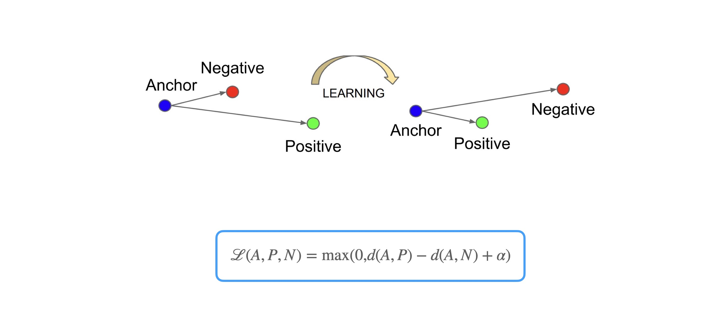
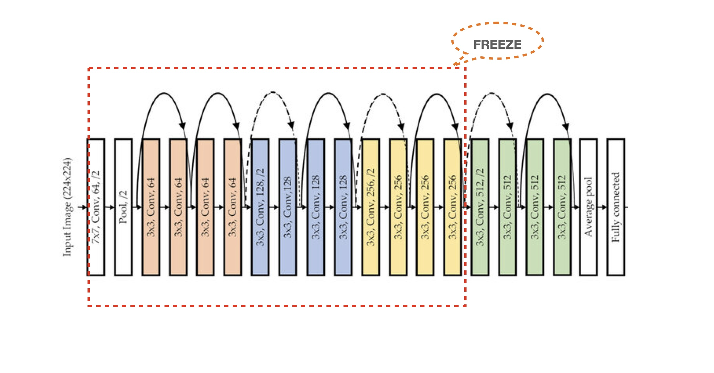
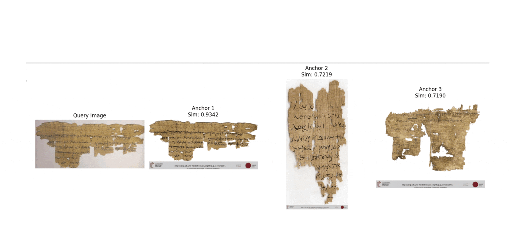

How this works!
===============================

**Sofware Architecture**

FastAPI is used to serve users. When a user submits a request, an image retrieval task is created on the backend and delegated to Celery workers. This approach ensures a responsive user interface and prevents overloading the web application. Celery, integrated with Redis, manages the task queue and tracks the status of each task. The client polls the server every second to fetch the current status and delivers the result once it is ready.

**Workflow**

When a user uploads a query image, it is first preprocessed and stored in a MinIO bucket. A Celery worker then requests the inference server to compute an embedding for the image using a trained model hosted on my Hugging Face Hub. Next, the system searches for the most similar images by comparing the computed embedding with precomputed embeddings of reference papyri images, which have been bulk-inserted into a PostgreSQL database.

**Neural Network Architecture**

The model employs a Siamese architecture built on a ResNet18 backbone to generate 128-bit embeddings. During training, the model processes image triplets consisting of an anchor image, a positive image (similar to the anchor), and a negative image (dissimilar to the anchor). A triplet loss function is used to optimize the model.

**Objective Function**

 The goal is to minimize the distance between the anchor and positive while maximizing the distance between the anchor and negative. This way, the model learns to create embeddings that cluster similar images closer together and separate dissimilar ones.

**Fine Tuning**

The model leverages a pretrained ResNet18 trained on ImageNet. During fine-tuning, the last block of layers is unfrozen and trained further to adapt to learn papyrus images, while all preceding layers remain frozen to retain their learned features from the original dataset.

**Results**

