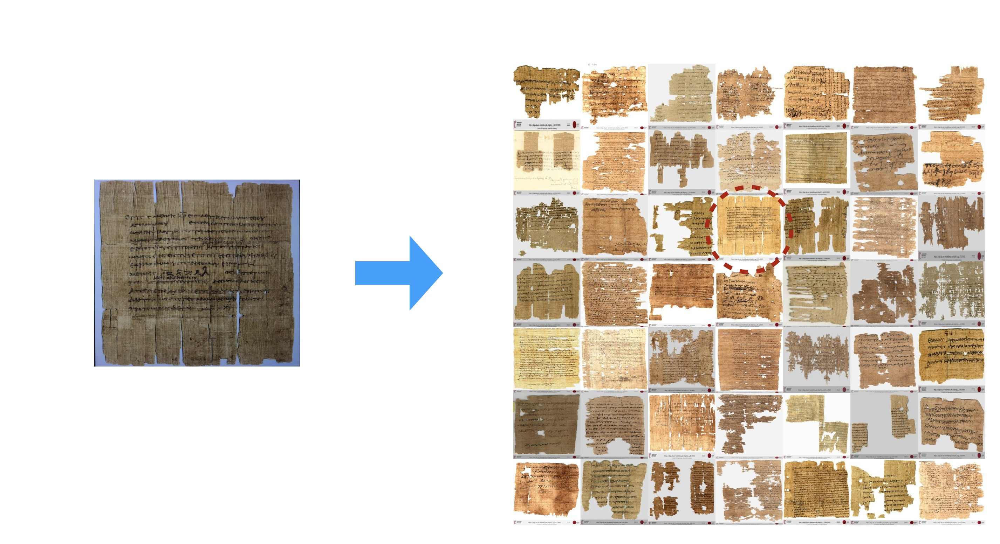
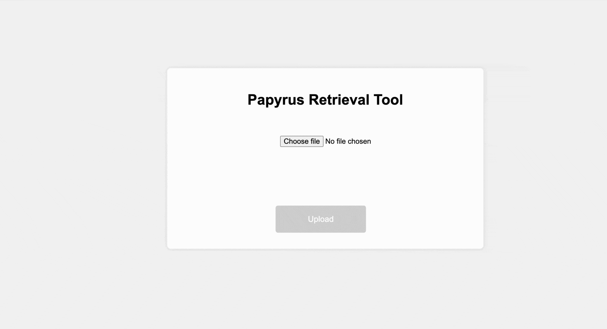

Introduction
============

This project is an end-to-end image retrieval webapp!  Our main goal is to retrieve similar papyrus images. This can be thought of as 'google lens' for papyrus images. The result is a hyperlink to the most similar papyrus and the the corresponding metadata and information about it can be found on `papyri.info <https://papyri.info/>`_

Use the installation guide to setup the project and download the data for demo. On successful installation, the webapp can be launched.

